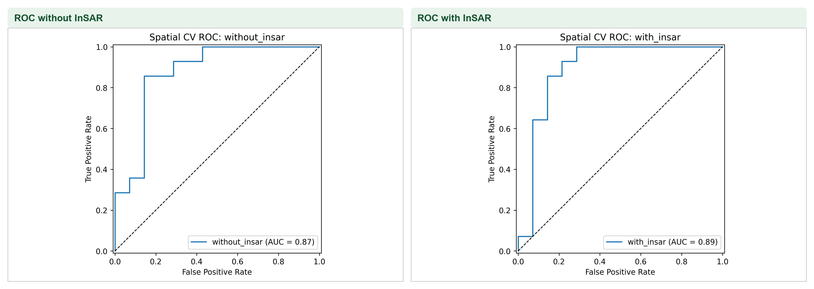
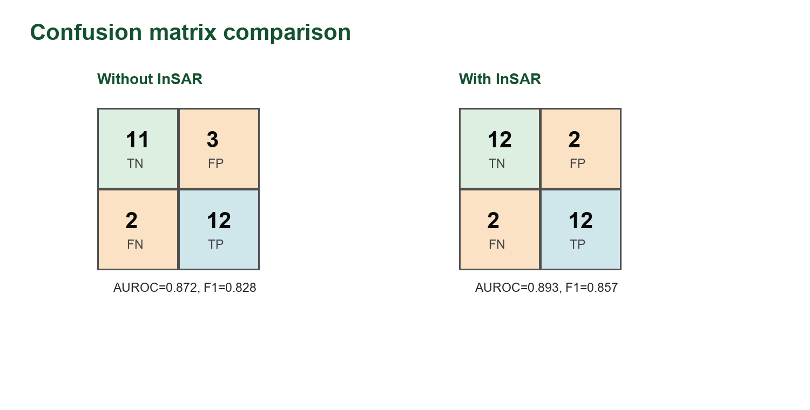
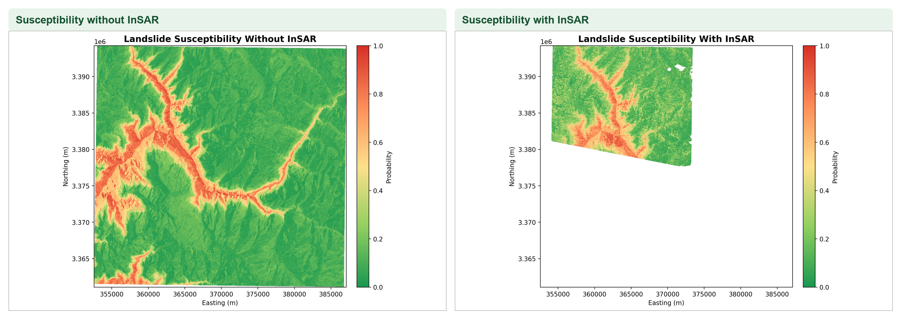
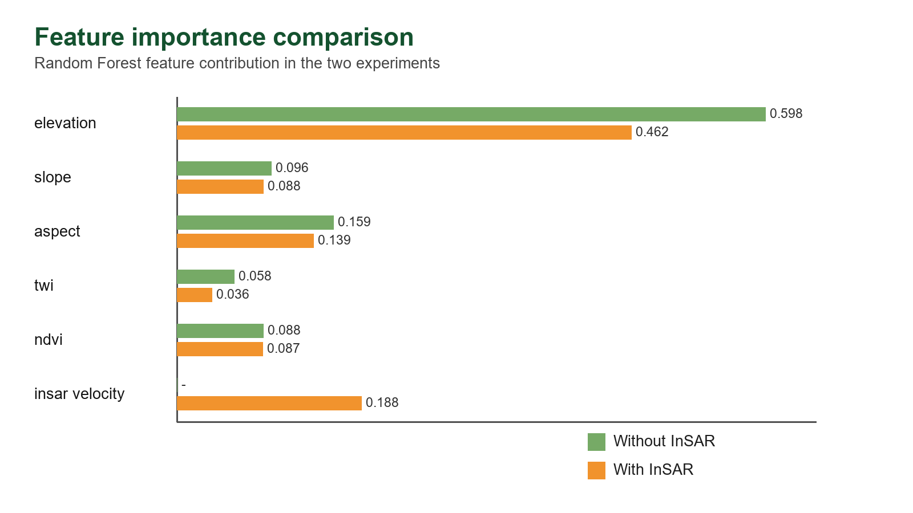

# InSAR-Assisted Random Forest Landslide Susceptibility Mapping for Joshimath, Uttarakhand

Sansar PhD Assignment - Stage 2 Mini-Project

## Abstract

This paper presents a landslide susceptibility mapping workflow for the Joshimath region of Uttarakhand using DEM-derived terrain variables, Sentinel-2 NDVI and InSAR line-of-sight velocity. A Random Forest model was trained with spatial cross-validation to reduce optimistic accuracy caused by nearby training and test samples. The baseline model used elevation, slope, aspect, TWI and NDVI, while the second model added InSAR velocity. The model without InSAR reached an AUROC of 0.872 and F1-score of 0.828. The InSAR-assisted model reached an AUROC of 0.893 and F1-score of 0.857, showing a modest but useful improvement from deformation information.

**Index Terms:** Landslide susceptibility, Joshimath, InSAR, Random Forest, Sentinel-2, DEM

## 1. Introduction

Joshimath is located in steep Himalayan terrain where relief, drainage, road cutting, settlement pressure and rainfall can combine to create unstable slopes. Landslide susceptibility mapping is useful because it estimates which parts of the landscape share conditions with known landslide locations. This paper presents a compact end-to-end workflow for preparing raster predictors, training a Random Forest classifier and testing whether InSAR deformation information improves the susceptibility model.

## 2. Study Area and Data

The study area is around Joshimath, Uttarakhand. The predictor stack included elevation, slope, aspect, topographic wetness index (TWI), Sentinel-2 NDVI and an InSAR line-of-sight velocity raster. The landslide inventory was converted to a binary training mask. All raster layers were clipped, reprojected and resampled to the same reference grid before sampling so that each training record represented a consistent pixel location.

## 3. Methodology

Two Random Forest experiments were compared. The baseline model used elevation, slope, aspect, TWI and NDVI. The second model used the same predictors plus InSAR velocity. Spatial cross-validation was used instead of a random split because nearby pixels can be highly similar and may inflate reported accuracy. The common valid InSAR coverage produced 28 samples, with 14 landslide and 14 non-landslide samples distributed across 23 spatial blocks and five folds.

## 4. Results

The baseline model without InSAR achieved an AUROC of 0.872, F1-score of 0.828, precision of 0.800 and recall of 0.857. Adding InSAR velocity increased AUROC to 0.893 and F1-score to 0.857. Precision improved to 0.857 while recall remained 0.857, indicating that the InSAR model reduced false positives without reducing landslide detection in this pilot sample.

| Experiment | AUROC | F1 | Precision | Recall | Samples |
|---|---:|---:|---:|---:|---:|
| Without InSAR | 0.872 | 0.828 | 0.800 | 0.857 | 28 |
| With InSAR | 0.893 | 0.857 | 0.857 | 0.857 | 28 |

## 5. Discussion

Feature importance indicates that elevation remained the dominant predictor, but its relative importance decreased after adding the velocity layer. InSAR velocity had an importance of 0.188 in the expanded model, suggesting that deformation information captured part of the signal previously represented indirectly by terrain. The result is geologically reasonable because active or slowly moving slopes can provide information that static topographic layers cannot fully express.

## 6. Limitations and Future Work

The analysis should be interpreted as a pilot demonstration because the common InSAR-valid sample was small and the absence samples were assumed stable rather than field verified. Future work should add more landslide polygons, a larger non-landslide sample, geology, distance to roads and streams, rainfall, land use, fault distance and an InSAR coherence mask. Independent temporal or nearby-area validation would also be needed before operational use.

## 7. Conclusion

The workflow produced an analysis-ready GIS stack and compared two spatially validated Random Forest susceptibility models. The InSAR-assisted model gave a moderate but useful accuracy improvement, so deformation information should be retained in future susceptibility mapping for Joshimath. The conclusion remains cautious because the pilot sample size and InSAR coverage were limited.

## References

[1] L. Breiman, "Random Forests," Machine Learning, vol. 45, pp. 5-32, 2001.

[2] European Space Agency, "Sentinel-2 MSI User Guide," accessed 2026.

[3] Copernicus Programme, "Copernicus DEM documentation," accessed 2026.

[4] General landslide susceptibility mapping literature using terrain factors, remote sensing and spatial validation.
